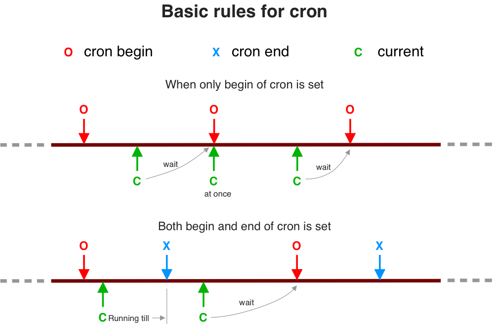
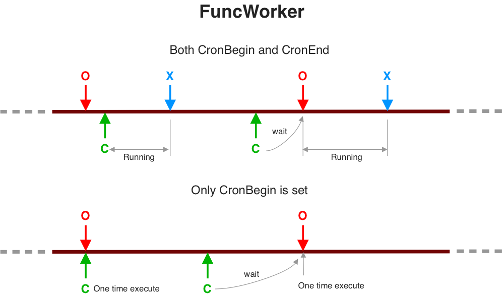

# Cron Scheduling

## Syntax

Expression of cron follows general cron of unix with `seconds` precise support.  

```
*      *      *      *      *      ?
|      |      |      |      |      |
sec   min    hour   day    month  week
```

`0 0 * * * ?` means beginning of each hour.

## Basic Rules

There are `CronBegin` and `CronEnd` when editing strategies. They can be used in two forms: CronBegin only indicats firing point while Begin-End both indicats available time range to schedule.  



## Cron for SimpleWorker

Not supported.

## Cron for FuncWorker



## ron for TaskWorker


