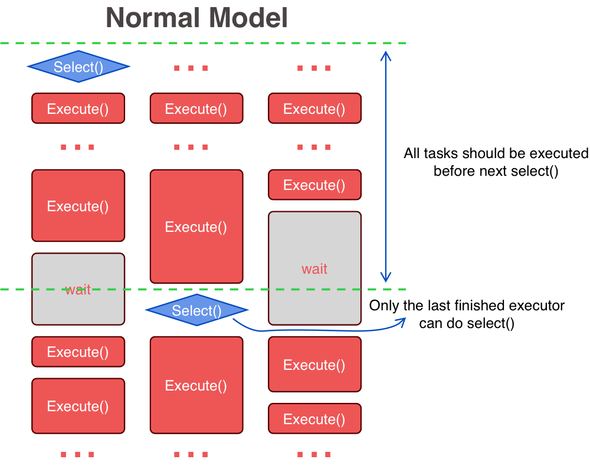
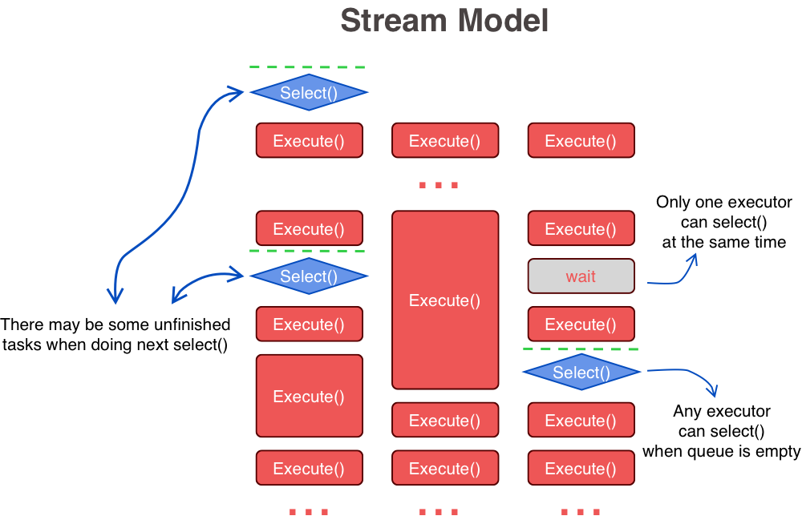

# Models of TaskWorker

There are two models for TaskWorker: `NormalModel` and `StreamModel`.  

NormalModel is designed for most cases. A select() will only be invoked when there are no running executor, in other words, only the last finished executor in one generation (execution of items returned by a select()) can invoke NEXT `select()`. It's easy to deal with in most cases. But if executing time of tasks are significantly different it will become a problem of barrel law.  

As shown below:  

StreamModel is designed for those cases which is focus on more efficient executing, or avoiding problem of barrel law, or non-strict consistent selecting. Things may become more complicated when you considerred logic of selecting.

As shown below:  

