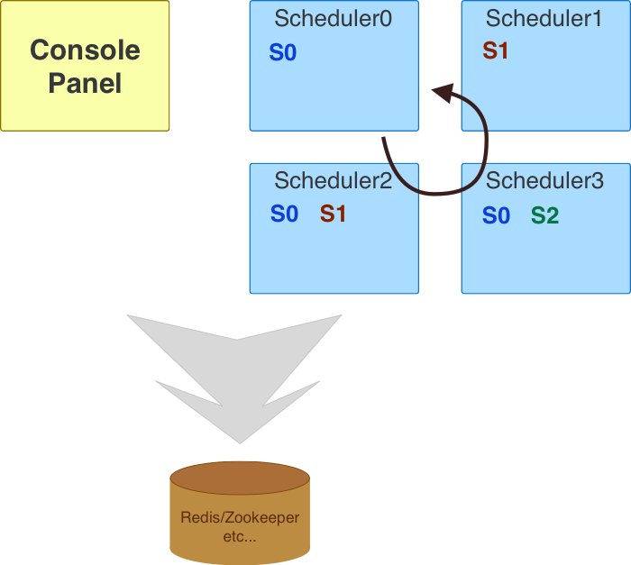

# GoSchedule

Distributed scheduling in golang.

## Introduction

GoSchedule is an in-process scheduler. It's modularized, efficient, high available, parameterized, partition supported and extensible.  

A web based console [goschedule-console](https://github.com/jasonjoo2010/goschedule-console) is provided as an easy to use operating panel to review runtimes/statistics, manage tasks/strategies/schedulers and manage data of storage.  

The first version of GoSchedule is implemented based on `tbschedule` which comes from Taobao®. Tbschedule became opensouce in 2011~2013 and stopped updating then. For an alternated please refer to [tbschedule](https://github.com/jasonjoo2010/tbschedule).  

The overview of design:  

  

## Quickstart

For SimpleWorker,

```go
type DemoWorker struct {
    notifier chan int
}

func (demo *DemoWorker) loop() {
    i := 1
LOOP:
    for {
        fmt.Println("working: ", i)
        select {
        case <-demo.notifier:
            break LOOP
        default:
            i++
            time.Sleep(time.Second)
        }
    }
}

func (demo *DemoWorker) Start(strategyId, parameter string) {
    if demo.notifier == nil {
        demo.notifier = make(chan int)
    }
    go demo.loop()
    fmt.Println("worker started")
}

func (demo *DemoWorker) Stop(strategyId, parameter string) {
    fmt.Println("prepare to stop")
    demo.notifier <- 1
    fmt.Println("worker exited")
}

...
manager, err := core.New(redis.New("/schedule/demo/simple", "127.0.0.1", 6379))
if err != nil {
    fmt.Println(err)
    return
}
worker.RegisterName("DemoWorker", &DemoWorker{})
manager.Start()
...
```

For FuncWorker,

```go
var counterShared int = 0

func DemoFunc(strategyId, param string) {
    fmt.Println("current: ", counterShared)
    counterShared++
    // simulate time cost
    time.Sleep(time.Millisecond * time.Duration(rand.Intn(500)))
}

...
manager, err := core.New(redis.New("/schedule/demo/func", "10.10.0.11", 6379))
if err != nil {
    // error
    fmt.Println(err)
    return
}
worker.RegisterFunc("DemoFunc", DemoFunc)
manager.Start()
...
```

## Examples

There is a playground project [here](https://github.com/jasonjoo2010/goschedule-examples).  

There are kinds of scenarios and all types of worker have their examples.

## Features

### High Availability

A simple HA is implemented based on storage which is considerred as reliable. It can satisfy most of common scenarios and it's not something like PAXOS or RAFT.  

All you should do is to make some free rooms to enable workers rescheduling between nodes.  

### Different Workers Support

There are currently three types of worker: `Simple`, `Func` and `Task`.  

SimpleWorker is the basic worker type which defines two hooks `Start()` and `Stop()` in life cycle.  

FuncWorker works perfectly in scenarios implementing simple and repeated logic which doesn't care about the life cycle.  

TaskWorker is a more complicated and powerful framework for select()->execute() like jobs. Partitioning can be easily configured.  

For more detail on design or explaination please refer to [Workers](WORKERS.md).

#### TaskItem of TaskWorker

Partitioning is supported through task items in TaskWorker. One TaskItem can only be assigned to one worker instance at most. For more details please refer to [Workers](WORKERS.md).

#### Running Models of TaskWorker

There are currently two running models for TaskWorker: `Normal` and `Stream`.  

The main difference between them is that whether unfinished tasks are allowed when invoking next `select()`. Thus `Normal` looks like more clean for selecting and `Stream` looks like more efficient for executing.  

If your task doesn't have a heavy load or "clean" doesn't affect your task's performance it's easier and clearer to use `Normal` model.

For more details please refer to [MODELS](MODELS.md).

### Load balancing

Your workers are distributed between nodes that can be scheduled on. The `balancing` has a meaning in two dimentions: In same strategy and over strategies.  

In the same strategy, requested count of worker are well distributed based on nodes. But if you have more single-worker strategy there may be still unbalanced. So a shuffling is introduced when rescheduling to optimize balancing over strategies.

### Cron

Two types of cron are supported:

* When you set both cron begin and end it means an available range of time can scheduling.
* When you set only begin, worker will be waked up at that time. But following actions may be different between types of worker.

For more details please refer to [CRON](CRON.md)

### Storage Support

Benefit of abstracting of storage kinds of backend can be easily supported:

* Memory(Only for local testing or local usage scenario)
* Redis
* Etcdv2
* Etcdv3
* Database
* Zookeeper

## Extending

New storage backend and new worker can be extended through interface `store.Store` and `worker.Worker`.
