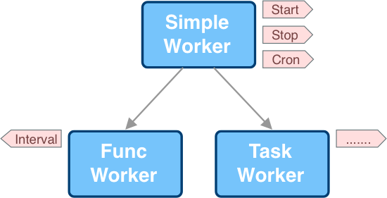
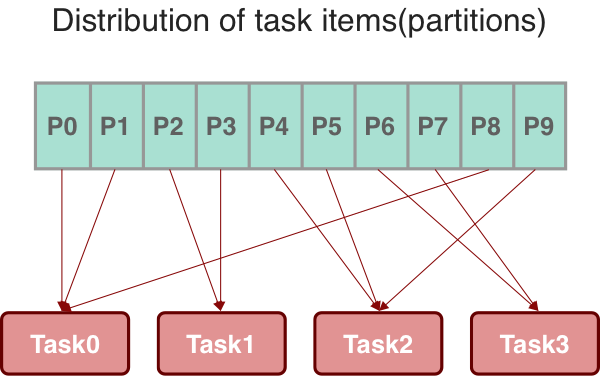

# Introduction of Workers

Workers include three types: `Simple`, `Func` and `Task`. `Simple` is the fundamental interface of worker and you can also extend a new worker implementing it.

We can use a figure to get an overview of them:

## Simple Worker

Simple worker acts like a thread with start-stop lifecycle. You can use it in start-stop scenarios like consumers of queue like RocketMQ/Kafka, goroutine loop, etc. .

Besides start/stop hooks it also supports parameter, cron expressions of begin/end. They are clustered togethor and defined as `strategy`.

## Func Worker

Compared to `Simple` worker `Func` worker doesn't care about the lifecyle and it focuses on business in single loop. The single loop logic can be scheduled in fixed rate, or fixed time driven by cron expression of begin, or invoked repeatedly in specified time segments driven by cron expressions. It acts more like a legacy `scheduled task`.

## Task Worker

`Task` worker is more complicated. A task worker can act quite differently in different scenarios. It supports partitioning, parellelism, batch processing, distributing and evironment definition. For simple worker which runs in single instance globally an arbitary partition is given and enough. But for heavier jobs in which partitions are necessary you can carefully define the partitions and they can be distributed among all worker instances well:

For more examples you can reach at [goschedule-examples/task_worker](https://github.com/jasonjoo2010/goschedule-examples/tree/master/task_worker).
